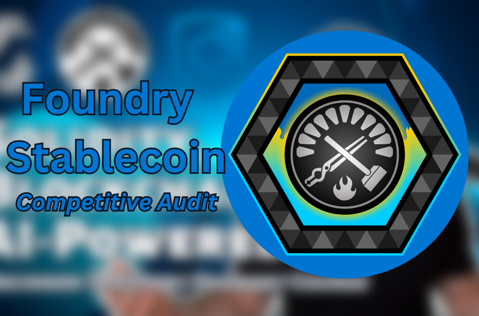
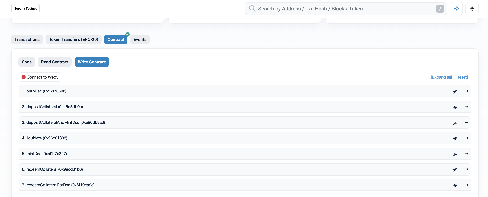

# Algorithmic Stability Coin (ASC): Building a Stable and Secure DeFi Ecosystem

## 1. (Relative Stability) Anchored or Pegged -> $1.00

1.  Chainlink Price Feed.
2.  Set a function to exchange ETH & BTC -> $

## 2. Stability Mechanism (Minting): Algorithmic (Decentralized)

1.  People can only mint the stablecoin with enough collateral (coded)

## 3. Collateral: Exogenous (Crypto)

1.  wETH
2.  wBTC

- calculate health factor function
- set health factor if debt is 0
- Added a bunch of view function

1.  What are our invariants/properties?

- Some proper oracle use ✅
- Write more tests ✅
- Smart Contract Audit Preparation ✅

DecentralizedStableCoin Contract CODE: https://sepolia.etherscan.io/address/0x9bbe1283aca76060db0cc60fbda3e4020615c267#code
DSCEngine Contract CODE: https://sepolia.etherscan.io/address/0x43a7c1a26f0f6fd7e42ed551b5e3b56dfd8a733f#code


# Getting Started

## Requirements

- [git](https://git-scm.com/book/en/v2/Getting-Started-Installing-Git)
  - You'll know you did it right if you can run `git --version` and you see a response like `git version x.x.x`
- [foundry](https://getfoundry.sh/)
  - You'll know you did it right if you can run `forge --version` and you see a response like `forge 0.2.0 (816e00b 2023-03-16T00:05:26.396218Z)`

## Quickstart

```
git clone https://github.com/Solidityarchitect/foundry-defi-stablecoin
cd foundry-defi-stablecoin
forge build
```

# Usage

## Start a local node

```
make anvil
```

## Deploy

This will default to your local node. You need to have it running in another terminal in order for it to deploy.

```
make deploy
```

## Deploy - Other Network

[See below](#deployment-to-a-testnet-or-mainnet)

## Testing

We talk about 4 test tiers in the video.

1. Unit
2. Integration
3. Forked
4. Staging

In this repo we cover #1 and Fuzzing.

```
forge test
```

### Test Coverage

```
forge coverage
```

and for coverage based testing:

```
forge coverage --report debug
```
